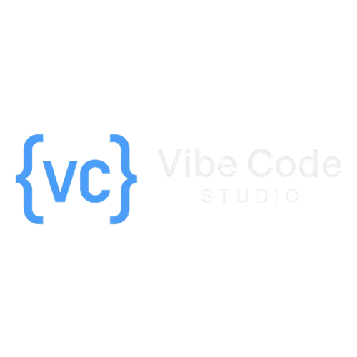

<b>🚀 Curated n8n workflow templates. Organized for fast discovery, learning, and reuse.</b>

🇹🇷 Repo name includes <code>-tr</code>, but content is <b>English-first</b> for global utility.

⚡ Quick Links

🌐 Official n8n Library: n8n.io/workflows (7,800+ templates)

💼 Collab / Training / Consulting: info@huseyinhobek.com

📦 What’s Inside

This repository provides ready-to-import n8n JSON workflows categorized into two main collections:

Directory

Description

templates/

💎 Curated: Hand-picked templates gathered from public sources. Optimized for quality.

workflows/

📚 Library: Bulk imported workflow archives (e.g., from Zie619). Useful for deep searching.

🛠️ How to Use (Import Guide)

Run any workflow in your n8n instance in 5 steps:

Select: Open any *.json file under templates/ or workflows/.

Copy: Copy the raw JSON content (or download the file).

Import: In your n8n dashboard, go to Workflows → Import from File (or press Ctrl+V to paste from clipboard).

Configure: Click on nodes with red warning signs to add your own Credentials (API Keys, OAuth, etc.).

Launch: Test and toggle to "Active". 🟢

📂 Folder Structure

.
├── templates/                 # Hand-picked templates
│   └── <category>/
│       └── <workflow>.json
│
└── workflows/                 # Extended library
    └── <category>/
        └── <workflow>.json

📊 Stats:
To count total workflows locally, run:

find templates workflows -type f -name "*.json" | wc -l

🛡️ Security & Hygiene

[!WARNING]
Check for Secrets: While this repository strives to be clean, public workflow JSON files may occasionally contain leftover API keys or tokens from their original authors.

ALWAYS check the credential fields inside nodes before activating.

Reporting Secrets: If you find a leftover secret, please open an issue or email info@huseyinhobek.com with the file path and line number.

⚖️ Disclaimer & Attribution

This repo is an aggregation for educational and convenience purposes.

Ownership: We do not claim ownership of third-party workflows unless explicitly stated. All rights belong to their respective authors.

Licenses: Each workflow is subject to its original author's license. If none is included, assume all rights are reserved by the original author.

Takedown Requests: If you are a rights holder and want content removed, please open an issue with the original source link.

🌟 Credits / Upstream Sources

enescingoz/awesome-n8n-templates

Zie619/n8n-workflows

Official n8n Library

🤝 Contributing (Strict Rules)

PRs are welcome if you provide:

🔗 Original source link.

✍️ Author attribution (where available).

📝 Short description + required credentials.

🔑 NO secrets/API keys in the JSON.

<i>Automation for everyone.</i>

